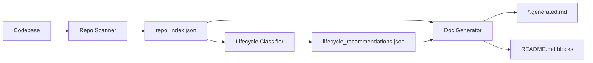

<!--
AUTO-GENERATED by Code Wiki System
Generated: 2025-12-19T01:55:15Z
Source: /Users/jay/code/codewiki/data/code_wiki/repo_index.json
Commit: unknown
DO NOT EDIT MANUALLY
Regenerate using: make code-wiki-docgen
-->

# Code Wiki – Architecture Overview

This document is auto-generated by the Code Wiki system to provide an overview
of the current codebase structure and statistics.

## Repository Statistics

- **Total files**: 27
- **Last scan**: 2025-12-19T01:55:15Z
- **Git commit**: `unknown`

### File Breakdown

- **config**: 3 files (11.1%)
- **doc**: 12 files (44.4%)
- **python**: 9 files (33.3%)
- **test**: 3 files (11.1%)

## System Architecture

The Code Wiki system consists of three main phases:

### Components

1. **Repo Scanner**: Traverses file system, classifies files, extracts metadata
2. **Lifecycle Classifier**: Analyzes file age and patterns, recommends actions
3. **Doc Generator**: Converts structured data to human-readable documentation

## Service Catalog Summary

Total services/scripts indexed: **9**

Lifecycle distribution:
- **keep**: 9 files

For detailed service catalog, see [SERVICE_CATALOG.generated.md](SERVICE_CATALOG.generated.md)
